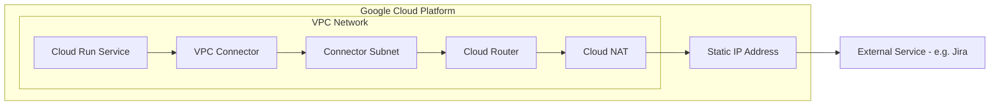

# Cloud Run Static IP Demo and Troubleshooting Guide

This repository provides a complete demo and troubleshooting guide for setting up Cloud Run services with a static outbound IP address using Cloud NAT.

## Problem Context

When deploying applications on Cloud Run, outbound requests use dynamic IP addresses that change with each redeployment. This becomes problematic when:
- Clients need to whitelist your service's IP address (e.g., accessing their Jira instance)
- Accessing external services like SFTP servers or APIs that require IP whitelisting
- Compliance requirements mandate known, static IP addresses

## Architecture Overview



## Quick Start

### Prerequisites

- Google Cloud SDK installed and configured
- A GCP project with billing enabled
- Required APIs enabled (Cloud Run, Compute Engine, VPC Access)

### Setup Steps

1. Clone this repository
2. Navigate to the scripts directory: `cd scripts`
3. Set your project ID and source environment:
   ```bash
   export PROJECT_ID="your-actual-project-id"
   source ./01-setup-environment.sh
   ```
4. Run the setup scripts in order:
   ```bash
   ./02-enable-apis.sh
   ./03-create-network.sh
   ./04-create-connector.sh
   ./05-create-nat.sh
   ./06-deploy-service.sh
   ./07-deploy-ip-checker.sh
   ```
5. Test the static IP:
   ```bash
   ./08-test-connectivity.sh
   ```
6. If issues occur, run diagnostics:
   ```bash
   ./09-diagnose.sh
   ```

## Repository Structure

```
cloudrun-static-ip/
├── README.md                           # This file
├── docs/
│   ├── ROOT_CAUSE_ANALYSIS.md         # Detailed analysis of potential issues
│   ├── TROUBLESHOOTING_QUESTIONS.md   # Questions to ask for diagnosis
│   ├── DEMO_SCRIPTS.md                # All demo scripts with explanations
│   ├── DIAGNOSTIC_GUIDE.md            # Step-by-step diagnostic procedures
│   └── ADDITIONAL_THOUGHTS.md         # Extra considerations and alternatives
└── scripts/                            # Executable bash scripts
    ├── 01-setup-environment.sh        # Set environment variables
    ├── 02-enable-apis.sh              # Enable required GCP APIs
    ├── 03-create-network.sh           # Create VPC and subnets
    ├── 04-create-connector.sh         # Create VPC connector
    ├── 05-create-nat.sh               # Create Cloud NAT with static IP
    ├── 06-deploy-service.sh           # Deploy Cloud Run service
    ├── 07-deploy-ip-checker.sh        # Deploy IP checker service
    ├── 08-test-connectivity.sh        # Test outbound connectivity
    ├── 09-diagnose.sh                 # Comprehensive diagnostics
    ├── 10-simulate-issues.sh          # Simulate common misconfigurations
    └── 99-cleanup.sh                  # Delete all demo resources (run last)
```

## Documentation Guide

| Document | Purpose |
|----------|---------|
| [ROOT_CAUSE_ANALYSIS.md](docs/ROOT_CAUSE_ANALYSIS.md) | Comprehensive analysis of what could cause the issue, both inside and outside GCP |
| [TROUBLESHOOTING_QUESTIONS.md](docs/TROUBLESHOOTING_QUESTIONS.md) | Diagnostic questions to ask customers, with expected answers and fixes |
| [DEMO_SCRIPTS.md](docs/DEMO_SCRIPTS.md) | All demo scripts documented with explanations |
| [DIAGNOSTIC_GUIDE.md](docs/DIAGNOSTIC_GUIDE.md) | Step-by-step diagnostic flowchart and procedures |
| [ADDITIONAL_THOUGHTS.md](docs/ADDITIONAL_THOUGHTS.md) | Alternatives, cost considerations, and best practices |

## Most Likely Root Cause

Based on common symptoms (DNS works, public requests timeout, no NAT logs):

**Primary Suspect: VPC egress set to `private-ranges-only`**

This is the #1 most common misconfiguration because:
- The `private-ranges-only` setting only routes traffic to private IP ranges (10.x, 172.16-31.x, 192.168.x) through the VPC connector
- Public internet traffic bypasses the connector entirely
- DNS often still works because it may use Google's resolvers
- Traffic to public IPs never reaches Cloud NAT

**Quick Fix:**
```bash
gcloud run services update SERVICE_NAME \
  --vpc-egress=all-traffic \
  --region=REGION
```

## Quick Diagnostic Checklist

Run these commands to quickly diagnose the issue:

```bash
# 1. Check VPC egress setting (should be "all-traffic")
gcloud run services describe SERVICE_NAME --region=REGION \
  --format="value(spec.template.spec.vpcAccess.egress)"

# 2. Check VPC connector is attached
gcloud run services describe SERVICE_NAME --region=REGION \
  --format="value(spec.template.spec.vpcAccess.connector)"

# 3. Check NAT subnet coverage (should include connector subnet)
gcloud compute routers nats describe NAT_NAME \
  --router=ROUTER_NAME --region=REGION \
  --format="value(sourceSubnetworkIpRangesToNat)"

# 4. Check for egress firewall rules
gcloud compute firewall-rules list \
  --filter="direction=EGRESS" \
  --format="table(name,priority,action)"

# 5. Get your static IP
gcloud compute addresses describe STATIC_IP_NAME \
  --region=REGION --format="value(address)"
```

## Common Issues and Solutions

| Issue | Symptom | Solution |
|-------|---------|----------|
| VPC egress = private-ranges-only | DNS works, HTTP times out, no NAT logs | Set `--vpc-egress=all-traffic` |
| NAT not covering connector subnet | No NAT logs | Use `--nat-all-subnet-ip-ranges` |
| Firewall blocking egress | Immediate rejection | Check/remove deny rules |
| NAT using auto IPs | Wrong IP in responses | Configure static IP pool |
| Missing default route | All traffic fails | Create route to default-internet-gateway |

## Demo Scenarios

The demo scripts support testing different failure scenarios:

1. **Scenario A:** Working configuration (run all scripts)
2. **Scenario B:** Simulate `private-ranges-only` issue
3. **Scenario C:** Simulate NAT not covering connector subnet
4. **Scenario D:** Simulate firewall blocking

See [DEMO_SCRIPTS.md](docs/DEMO_SCRIPTS.md) for details.

## Customer Troubleshooting Questions

Key questions to ask (see [TROUBLESHOOTING_QUESTIONS.md](docs/TROUBLESHOOTING_QUESTIONS.md) for full list):

1. What is your Cloud Run VPC egress setting?
2. Is a VPC connector attached to your service?
3. Is Cloud NAT configured to cover the connector subnet?
4. Are there any egress deny firewall rules?
5. What happens when you test with `curl https://httpbin.org/ip`?

## Static IP Reuse

The demo scripts support reusing the same static IP address across multiple runs:

- **`05-create-nat.sh`** checks if the static IP already exists before creating it. If found, it reuses the existing IP instead of creating a new one.
- **`99-cleanup.sh`** prompts you to confirm whether to release the static IP address. You can choose to keep it for reuse in future deployments.

This is useful when:
- Clients have already whitelisted your static IP
- You want to redeploy the demo without changing the IP
- You're iterating on configuration while maintaining the same IP for testing

**To reuse the same IP:**
1. Run `99-cleanup.sh` and choose **"n"** when asked about releasing the static IP
2. Re-run the setup scripts (`02-enable-apis.sh` through `07-deploy-ip-checker.sh`)
3. The existing static IP will be automatically detected and reused

## Cleanup

When done, clean up all resources:
```bash
cd scripts
./99-cleanup.sh
```

**Note:** During cleanup, you'll be asked whether to release the static IP. Choose "y" to fully clean up, or "n" to preserve the IP for future use.

## Additional Resources

- [Google Cloud Documentation: Static Outbound IP](https://cloud.google.com/run/docs/configuring/static-outbound-ip)
- [VPC Access Connectors](https://cloud.google.com/vpc/docs/configure-serverless-vpc-access)
- [Cloud NAT Overview](https://cloud.google.com/nat/docs/overview)
- [Cloud Run Networking](https://cloud.google.com/run/docs/configuring/connecting-vpc)

## License

MIT License - See LICENSE file for details