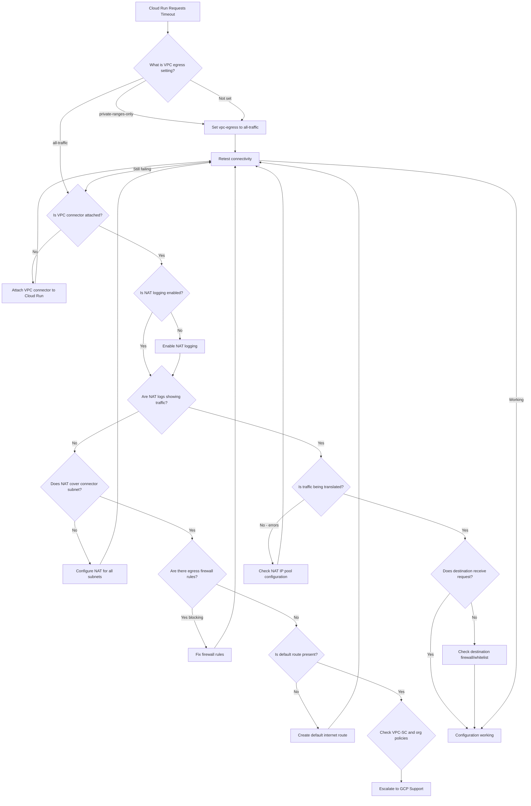

# Cloud Run Static IP - Step-by-Step Diagnostic Guide

This guide provides a systematic approach to diagnosing Cloud Run static IP issues.

## Diagnostic Flowchart



## Phase 1: Verify Cloud Run Configuration

### Step 1.1: Check VPC Egress Setting

**Command:**
```bash
gcloud run services describe SERVICE_NAME --region=REGION \
  --format="value(spec.template.spec.vpcAccess.egress)"
```

**Expected Result:** `all-traffic`

**If Result is `private-ranges-only` or empty:**
This is the most common cause. Traffic to public IPs bypasses the VPC connector.

**Fix:**
```bash
gcloud run services update SERVICE_NAME \
  --vpc-egress=all-traffic \
  --region=REGION
```

### Step 1.2: Verify VPC Connector Attachment

**Command:**
```bash
gcloud run services describe SERVICE_NAME --region=REGION \
  --format="value(spec.template.spec.vpcAccess.connector)"
```

**Expected Result:** `projects/PROJECT/locations/REGION/connectors/CONNECTOR_NAME`

**If empty:**
No connector is attached. Traffic cannot route through VPC.

**Fix:**
```bash
gcloud run services update SERVICE_NAME \
  --vpc-connector=CONNECTOR_NAME \
  --vpc-egress=all-traffic \
  --region=REGION
```

### Step 1.3: Confirm Region Match

**Commands:**
```bash
# Get Cloud Run region
gcloud run services describe SERVICE_NAME \
  --format="value(metadata.labels['cloud.googleapis.com/location'])"

# Get Connector region  
gcloud compute networks vpc-access connectors describe CONNECTOR_NAME \
  --region=REGION --format="value(region)"
```

**Expected Result:** Both should be identical

**If different:**
VPC connectors must be in the same region as Cloud Run services.

---

## Phase 2: Verify Cloud NAT Configuration

### Step 2.1: Enable NAT Logging

**Check current status:**
```bash
gcloud compute routers nats describe NAT_NAME \
  --router=ROUTER_NAME \
  --region=REGION \
  --format="value(logConfig.enable)"
```

**If not True, enable:**
```bash
gcloud compute routers nats update NAT_NAME \
  --router=ROUTER_NAME \
  --region=REGION \
  --enable-logging \
  --log-filter=ALL
```

### Step 2.2: Check NAT Subnet Coverage

**Command:**
```bash
gcloud compute routers nats describe NAT_NAME \
  --router=ROUTER_NAME \
  --region=REGION \
  --format="yaml(sourceSubnetworkIpRangesToNat,subnetworks)"
```

**Expected Result:** 
- `sourceSubnetworkIpRangesToNat: ALL_SUBNETWORKS_ALL_IP_RANGES`
- OR the VPC connector subnet explicitly listed

**If connector subnet not covered:**
```bash
gcloud compute routers nats update NAT_NAME \
  --router=ROUTER_NAME \
  --region=REGION \
  --nat-all-subnet-ip-ranges
```

### Step 2.3: Verify Static IP Assignment

**Command:**
```bash
gcloud compute routers nats describe NAT_NAME \
  --router=ROUTER_NAME \
  --region=REGION \
  --format="value(natIps)"
```

**Expected Result:** List of static IP addresses

**If empty (auto-allocated IPs):**
```bash
# Reserve static IP
gcloud compute addresses create STATIC_IP_NAME --region=REGION

# Assign to NAT
gcloud compute routers nats update NAT_NAME \
  --router=ROUTER_NAME \
  --region=REGION \
  --nat-external-ip-pool=STATIC_IP_NAME
```

### Step 2.4: Get the Static IP Value

**Command:**
```bash
gcloud compute addresses describe STATIC_IP_NAME \
  --region=REGION \
  --format="value(address)"
```

This is the IP to whitelist with your client.

---

## Phase 3: Check Network Configuration

### Step 3.1: Verify Default Internet Route

**Command:**
```bash
gcloud compute routes list \
  --filter="network=NETWORK_NAME AND destRange=0.0.0.0/0"
```

**Expected Result:** A route with `nextHopGateway: default-internet-gateway`

**If missing:**
```bash
gcloud compute routes create default-internet-route \
  --network=NETWORK_NAME \
  --destination-range=0.0.0.0/0 \
  --next-hop-gateway=default-internet-gateway
```

### Step 3.2: Check Firewall Rules

**Command:**
```bash
gcloud compute firewall-rules list \
  --filter="direction=EGRESS AND network=NETWORK_NAME" \
  --format="table(name,priority,action,destinationRanges)"
```

**Look for:** Any DENY rules with priority lower than 65535 (lower = higher priority)

**If blocking rules exist:**
Either remove them or create an ALLOW rule with lower priority:
```bash
gcloud compute firewall-rules create allow-egress-all \
  --direction=EGRESS \
  --priority=100 \
  --network=NETWORK_NAME \
  --action=ALLOW \
  --rules=all \
  --destination-ranges=0.0.0.0/0
```

---

## Phase 4: Analyze NAT Logs

### Step 4.1: View Recent NAT Logs

**Command:**
```bash
gcloud logging read "resource.type=nat_gateway AND resource.labels.router_id=ROUTER_NAME" \
  --limit=50 \
  --format="table(timestamp,jsonPayload.connection.src_ip,jsonPayload.connection.dest_ip,jsonPayload.allocation_status)"
```

### Step 4.2: Check for Allocation Failures

**Command:**
```bash
gcloud logging read "resource.type=nat_gateway AND jsonPayload.allocation_status!=OK" \
  --limit=20
```

**If seeing allocation failures:**
- Increase the number of NAT IPs
- Check for port exhaustion

---

## Phase 5: Test Connectivity

### Step 5.1: Deploy Test Service

Deploy a simple service to test outbound connectivity:

```bash
# Deploy a test service
gcloud run deploy test-ip \
  --image=gcr.io/cloudrun/hello \
  --region=REGION \
  --vpc-connector=CONNECTOR_NAME \
  --vpc-egress=all-traffic \
  --allow-unauthenticated
```

### Step 5.2: Test from Cloud Shell

Use Cloud Run Jobs to test:

```bash
gcloud run jobs create test-outbound \
  --image=curlimages/curl \
  --region=REGION \
  --vpc-connector=CONNECTOR_NAME \
  --vpc-egress=all-traffic \
  --command="curl" \
  --args="https://httpbin.org/ip"

gcloud run jobs execute test-outbound --region=REGION
```

Check the logs to see the outbound IP.

---

## Common Scenarios and Solutions

### Scenario 1: DNS Works, HTTP Fails

**Symptoms:**
- `nslookup` or DNS queries work
- HTTP/HTTPS requests timeout
- No NAT logs

**Cause:** VPC egress set to `private-ranges-only`

**Why:** DNS queries to Google's servers (8.8.8.8) might bypass the connector, while HTTP traffic to public IPs needs the connector.

**Solution:** Set `--vpc-egress=all-traffic`

---

### Scenario 2: No NAT Logs at All

**Symptoms:**
- All outbound requests timeout
- NAT logging enabled but no logs
- VPC egress is `all-traffic`

**Cause:** NAT not covering the VPC connector subnet

**Solution:** Use `--nat-all-subnet-ip-ranges`

---

### Scenario 3: Random IPs in Response

**Symptoms:**
- Requests work but show different IPs
- IP doesn't match your static NAT IP

**Cause:** NAT using auto-allocated IPs

**Solution:** Configure static IP pool for NAT

---

### Scenario 4: Intermittent Failures

**Symptoms:**
- Sometimes works, sometimes times out
- NAT logs show allocation failures

**Cause:** NAT port exhaustion

**Solution:** Add more NAT IPs or enable dynamic port allocation

---

## Diagnostic Command Summary

```bash
# === Cloud Run ===
# Check egress setting
gcloud run services describe SERVICE --region=REGION \
  --format="value(spec.template.spec.vpcAccess.egress)"

# Check connector
gcloud run services describe SERVICE --region=REGION \
  --format="value(spec.template.spec.vpcAccess.connector)"

# === VPC Connector ===
gcloud compute networks vpc-access connectors describe CONNECTOR \
  --region=REGION

# === Cloud NAT ===
gcloud compute routers nats describe NAT --router=ROUTER --region=REGION

# === Firewall ===
gcloud compute firewall-rules list --filter="direction=EGRESS"

# === Routes ===
gcloud compute routes list --filter="destRange=0.0.0.0/0"

# === NAT Logs ===
gcloud logging read "resource.type=nat_gateway" --limit=20

# === Static IP ===
gcloud compute addresses describe IP_NAME --region=REGION
```

---

## Escalation Checklist

Before escalating to Google Cloud Support, ensure you have:

- [ ] Verified VPC egress is `all-traffic`
- [ ] Confirmed VPC connector is attached
- [ ] Checked NAT covers connector subnet
- [ ] Enabled and reviewed NAT logs
- [ ] Verified no blocking firewall rules
- [ ] Confirmed default internet route exists
- [ ] Tested with a simple endpoint (httpbin.org/ip)
- [ ] Collected all diagnostic command outputs
- [ ] Noted specific error messages if any
- [ ] Documented the timeline of when issue started