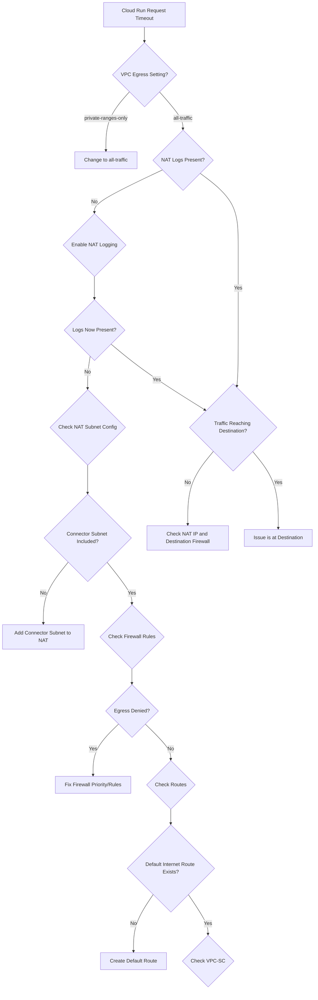

# Cloud Run Static IP - Root Cause Analysis

## Problem Summary
After configuring Cloud NAT with a static IP for Cloud Run services:
- Internet requests timeout
- Requests are not logged in Cloud NAT
- DNS resolution works correctly
- Public requests fail

## Potential Root Causes

### 1. Inside Google Cloud

#### A. VPC Egress Setting Configuration (Most Likely)
**Issue:** Cloud Run VPC egress is set to `private-ranges-only` instead of `all-traffic`

**Explanation:**
- `private-ranges-only`: Only traffic to private IP ranges (RFC 1918) goes through the VPC connector
- `all-traffic`: ALL traffic (including public internet) goes through the VPC connector

**Symptom Match:** ✅
- DNS works (DNS queries to 8.8.8.8 bypass the connector with private-ranges-only)
- Public requests fail (they don't go through the VPC connector/NAT)
- No NAT logs (traffic never reaches NAT)

**Solution:**
```bash
gcloud run services update SERVICE_NAME \
  --vpc-egress=all-traffic \
  --vpc-connector=CONNECTOR_NAME
```

---

#### B. Cloud NAT Subnet Configuration
**Issue:** Cloud NAT not configured to NAT traffic from the VPC connector's subnet

**Explanation:**
- VPC connectors create/use a specific subnet
- Cloud NAT must explicitly include this subnet in its NAT configuration
- If using "Custom" subnet selection, the connector subnet might be excluded

**Symptom Match:** ✅
- DNS works (if using Google's DNS which might bypass NAT)
- No NAT logs (traffic reaches router but NAT ignores it)

**Solution:**
```bash
# Check NAT configuration
gcloud compute routers nats describe NAT_NAME \
  --router=ROUTER_NAME \
  --region=REGION

# Update to include all subnets or specifically add connector subnet
gcloud compute routers nats update NAT_NAME \
  --router=ROUTER_NAME \
  --region=REGION \
  --nat-all-subnet-ip-ranges
```

---

#### C. Missing or Incorrect Cloud Router
**Issue:** Cloud Router not properly configured or in wrong region

**Explanation:**
- Cloud NAT requires a Cloud Router in the same region
- The router must have the correct network attached

**Symptom Match:** ⚠️ Partial
- Would cause all NAT traffic to fail

**Solution:**
```bash
# Verify router configuration
gcloud compute routers describe ROUTER_NAME --region=REGION

# Ensure router is attached to correct network
gcloud compute routers create ROUTER_NAME \
  --network=NETWORK_NAME \
  --region=REGION
```

---

#### D. VPC Connector Region Mismatch
**Issue:** VPC connector is in a different region than Cloud Run service

**Explanation:**
- VPC connectors must be in the same region as the Cloud Run service
- Cross-region connector attachment is not supported

**Symptom Match:** ❌
- Would fail to attach, not timeout

**Solution:**
```bash
# Create connector in same region as Cloud Run
gcloud compute networks vpc-access connectors create CONNECTOR_NAME \
  --region=SAME_REGION_AS_CLOUD_RUN \
  --subnet=SUBNET_NAME \
  --subnet-project=PROJECT_ID
```

---

#### E. Firewall Rules Blocking Egress
**Issue:** Explicit firewall rules with higher priority blocking egress traffic

**Explanation:**
- Default VPC allows all egress (implicit rule at priority 65535)
- Custom deny rules with lower priority numbers can block traffic
- The connector's service account or IP range might be affected

**Symptom Match:** ✅
- Matches the timeout behavior
- Traffic blocked before reaching NAT

**Solution:**
```bash
# List all firewall rules
gcloud compute firewall-rules list --filter="direction=EGRESS"

# Create explicit allow rule with high priority
gcloud compute firewall-rules create allow-connector-egress \
  --direction=EGRESS \
  --priority=100 \
  --network=NETWORK_NAME \
  --action=ALLOW \
  --rules=all \
  --destination-ranges=0.0.0.0/0 \
  --target-tags=vpc-connector
```

---

#### F. Missing Default Internet Gateway Route
**Issue:** Custom VPC missing the default route to internet gateway

**Explanation:**
- Custom VPCs might not have auto-created routes
- The 0.0.0.0/0 route to default-internet-gateway might be missing or deleted

**Symptom Match:** ✅
- Traffic has nowhere to go
- Would timeout without NAT logs

**Solution:**
```bash
# Check routes
gcloud compute routes list --filter="network=NETWORK_NAME"

# Create default route if missing
gcloud compute routes create default-internet \
  --network=NETWORK_NAME \
  --destination-range=0.0.0.0/0 \
  --next-hop-gateway=default-internet-gateway
```

---

#### G. Cloud NAT Logging Not Enabled
**Issue:** NAT logging disabled, so traffic might actually reach NAT but not be logged

**Explanation:**
- By default, Cloud NAT logging might be disabled
- Need to enable logging to see what's happening

**Symptom Match:** ⚠️ Partial
- Would explain missing logs but not the timeout

**Solution:**
```bash
gcloud compute routers nats update NAT_NAME \
  --router=ROUTER_NAME \
  --region=REGION \
  --enable-logging \
  --log-filter=ALL
```

---

#### H. VPC Service Controls
**Issue:** VPC Service Controls perimeter blocking egress

**Explanation:**
- If project is within a VPC-SC perimeter, egress to internet might be blocked
- Requires explicit egress policies

**Symptom Match:** ✅
- Would cause timeout with no NAT logs

**Solution:**
Check Security Command Center or org policies for VPC-SC configurations.

---

#### I. Private Google Access Interference
**Issue:** Private Google Access routing interfering with public traffic

**Explanation:**
- Rare, but misconfigured Private Google Access routes could interfere

**Symptom Match:** ❌ Unlikely

---

#### J. Cloud Run Service Identity Permissions
**Issue:** Service account lacks necessary permissions

**Explanation:**
- Usually not required for network egress
- But might affect certain scenarios

**Symptom Match:** ❌ Unlikely for this issue

---

### 2. Outside Google Cloud

#### A. Destination Firewall/WAF Blocking
**Issue:** Target Jira instance blocking the new static IP

**Explanation:**
- Jira might have IP whitelisting that needs updating
- WAF rules might be blocking

**Symptom Match:** ⚠️ Partial
- Would see NAT logs if traffic reaches NAT
- But timeout suggests traffic never leaves GCP

---

#### B. Transit/ISP Issues
**Issue:** Network path issues between GCP and destination

**Explanation:**
- Rare but possible
- Usually transient

**Symptom Match:** ❌ Unlikely

---

## Diagnostic Flow Chart



## Most Likely Cause

Based on the symptoms described:
1. **DNS works** - Suggests basic network connectivity exists
2. **Public requests fail** - Suggests VPC connector not routing public traffic
3. **No NAT logs** - Traffic never reaches NAT

**Primary Suspect: VPC egress set to `private-ranges-only`**

This is the most common misconfiguration because:
- Google's documentation mentions it but it's easy to miss
- The setting name `private-ranges-only` might seem sufficient
- DNS still works because it often bypasses the connector

**Secondary Suspect: Cloud NAT not configured for connector subnet**

This happens when:
- Cloud NAT is set to NAT specific subnets only
- The VPC connector subnet was not included in the list

## Recommended Diagnostic Steps

1. Verify VPC egress setting on Cloud Run service
2. Enable Cloud NAT logging if not already enabled
3. Check Cloud NAT subnet configuration
4. Verify firewall rules don't block egress
5. Confirm default internet route exists
6. Test with a simple endpoint (httpbin.org/ip)